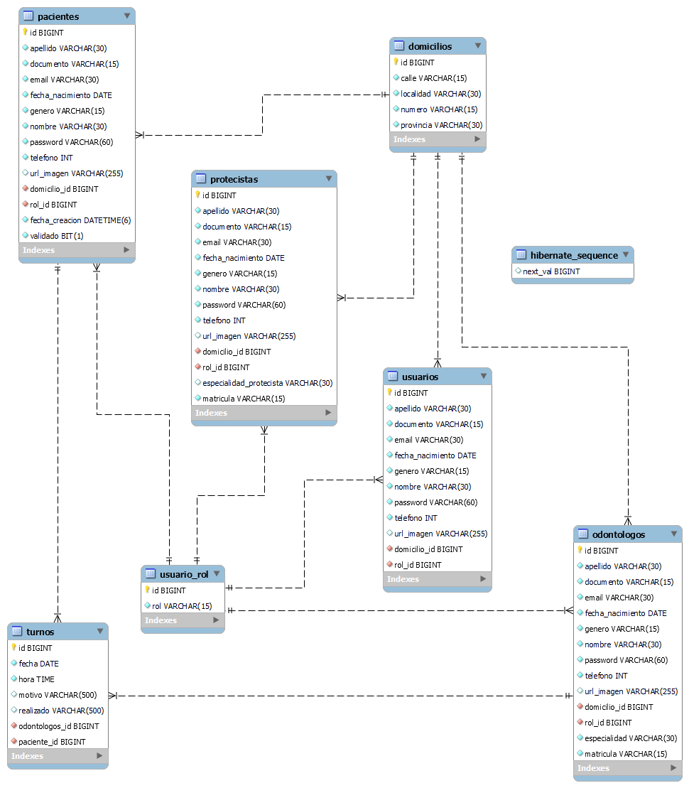
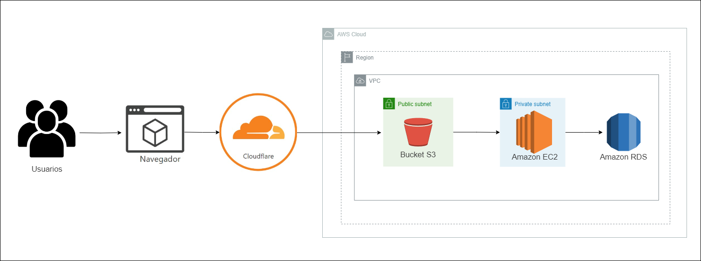

## Odontotal

Enlace aplicación: http://odontotal.online/ <br/>
- **Usuario Administrador**<br/>
correo: admin@gmail.com<br/>
contraseña: 12345
- **Usuario Odontólogo**<br/>
correo: odontologo@gmail.com<br/>
contraseña: 12345
- **Usuario Paciente**<br/>
correo: paciente@gmail.com<br/>
contraseña: 12345
<br/>

- **Nombre del proyecto:** **_Odontotal_**
- **Resumen general del proyecto:** En los últimos meses se desarrolló Odontotal, esta aplicación ofrece los servicios de una clínica odontológica. Con Odontotal, los usuarios pueden agendar citas con diversos especialistas, según su horario de preferencia, una vez que se han registrado en la plataforma. Además, la aplicación cuenta con funcionalidades de gestión tanto para un administrador como para los odontólogos, quienes pueden acceder a la aplicación y utilizar sus recursos para llevar a cabo un seguimiento médico de sus pacientes. <br>
Este proyecto fue un esfuerzo colaborativo grupal, en el que se llevaron a cabo múltiples tareas, tales como el desarrollo de un sólido backend, la creación de un atractivo frontend, la administración de la base de datos, la implementación de despliegues en la plataforma AWS y la adopción de metodologías ágiles como Scrum y Kanban.

## Equipo

- **César Rojas**

- **Luciano Gelvez**

- **Rafael Ramirez**

- **Santiago Crescimbeni**<br>

## Tecnologías utilizadas

**Desarrollo del proyecto:**

- Entornos de desarrollo integrados (IDEs): IntelliJ IDEA Community y Visual Studio Code.
- Sistemas de control de versiones: Git (GitHub - GitLab).
- Simulación / Virtualización: Utilización de una cuenta en Amazon Web Services (AWS).

**Tecnologías utilizadas para el desarrollo del sitio:**

- **Frontend**

  - React
    - react-bootstrap (estilos)
    - react-datepicker (calendario)
    - react-multi-carousel (carrusel imágenes)
    - react-router-dom (rutas)
  - CSS
  - emailjs (envio correos)
  - fontawesome (iconos)
  - google maps
  - Sass
  - sweet alert 2 (alertas)

- **Backend**

  - Java
    - Spring
    - Spring Boot
    - Spring Boot Mail
    - Spring Security
    - API Rest
    - Servicios de AWS (S3)
    - Jsoup
  - JWT
  - Maven

- **Base de datos**

  - MySQL

- **Infraestructura**

  - AWS
    - RDS para la base de datos MySQL
    - EC2 para alojar el backend
    - Dos buckets en S3, uno para alojar las imágenes y el otro para el sitio web estático del frontend.
    - Despliegues automatizados en AWS utilizando pipelines en GitLab

- **Testing**
  - Postman

## Documentación técnica del proyecto

### **Ambiente de desarrollo**

**Instrucciones para armar el ambiente de desarrollo para un nuevo integrante**

- Instalación de los IDEs: IntelliJ IDEA y Visual Studio Code.
- Instalación de MySQL Workbench
- Instalación de Postman
- Instalación de Git
- Clonar el repositorio
- Ir a la carpeta 'Clinica-Odontotal'
- Abrir la carpeta 'Odontotal/Odontotal' en IntelliJ y la carpeta 'Odontotal-React' en Visual Studio Code.

**Base de datos:**

  - Abrir MySQL WorkBench y ejecutar el siguiente script para creación del esquema de datos y tablas
  - Script para crear el esquema: schema_odontototal.sql

- Estructura y diagrama<br>



**Backend:**

- Poner credenciales del username y password de MySQL WorkBench en el application.properties
- Ejecutar el proyecto de Intellij
- Usar http://localhost:8080 para usar las API's

**Frontend:**

 - Abrir una terminal en Visual Studio code que esté ubicada en la carpeta de Frontend
 - Ejecutar los siguientes comandos

```
$ npm install
```

```
$ npm run dev
```

- Se ejecutará el proyecto del frontend en http://localhost:5173

**Infraestructura**

- Estructura y diagramas



**Testing**

- Pruebas de API's en Postman.
